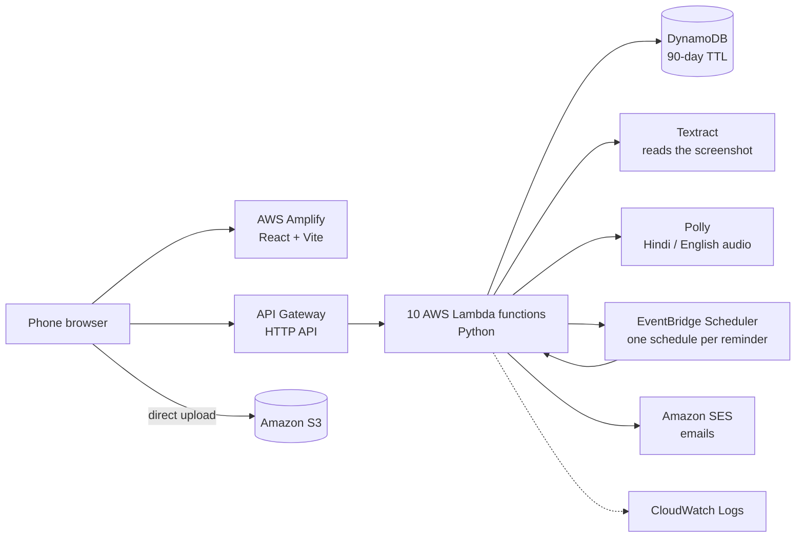

# Thaam थाम

**A free web app that guides people in India through the first hours and the next 90 days after losing money to a UPI or online-payment fraud.**

**Live:** https://main.dhg3lzpzbimpz.amplifyapp.com  ·  Built solo in 3 days for the AWS × WeMakeDevs **First Commit** hackathon (Sept 2026)

---

## The problem

After a fraud, a victim has to call the **1930** helpline fast, file a complaint on **cybercrime.gov.in**, and write to their bank before RBI deadlines that decide whether they get the money back. Most people don't know these deadlines exist, and they have to act while in shock.

## How it works

1. **Call 1930**: the first screen puts the helpline one tap away.
2. **Add your screenshot**: Thaam reads the debit SMS or UPI screen and fills in the amount, date, UTR and payee for you to check.
3. **Get your plan**:
   - a call script in English and हिन्दी, with audio;
   - a checklist with every deadline shown as "in N days";
   - ready-to-paste complaint text;
   - a letter to your bank.

**Optional:** email reminders before each deadline, a one-time email to a family member, and **Delete my case now** at any time.

> Thaam never files anything for you, is not affiliated with any bank or government body, and is guidance, not legal advice.

## Highlights

- **Serverless on AWS**: 10 Lambda functions, each with its own least-privilege IAM role, all defined as code with AWS SAM
- **Privacy by design**:
  - no account needed, and the case link is the only key;
  - screenshots are deleted after 7 days and cases after 90;
  - emails never contain financial details.
- **Accessible**: WCAG 2.2 AA (axe: 0 violations), 44 px tap targets, Hindi typography, light and dark themes
- **Fast**: about 95 kB (gzip) of code on first load, and self-hosted fonts with zero third-party requests
- **Tested**: about 770 automated tests (477 frontend with Vitest, about 295 backend with pytest)

## Architecture



| AWS service | Role in Thaam |
|---|---|
| Amplify Hosting | Builds and serves the web app from GitHub |
| API Gateway (HTTP API) | 9 routes, CORS locked to the app |
| Lambda × 10 | One small function per job, least-privilege IAM |
| S3 | Screenshots (7 days) and audio (90 days), encrypted, private |
| DynamoDB | One record per case, auto-deleted after 90 days (TTL) |
| Textract | Reads the text on the screenshot |
| Polly | Speaks the call script in Hindi and English |
| EventBridge Scheduler | Fires each reminder at the right time, then deletes itself |
| SES | Reminder and family emails |
| CloudWatch Logs | Logs with a hashed case fingerprint, never the case ID |
| AWS SAM | The whole backend as infrastructure-as-code |

## Run it locally

```bash
# Backend (AWS CLI + SAM CLI + Python 3.14)
cd backend && pip install -r requirements-dev.txt && pytest
sam build && sam deploy        # parameters live in samconfig.toml

# Frontend
cd frontend && npm ci && npm test && npm run dev   # http://localhost:5173

# Secret scanning on every commit
git config core.hooksPath .githooks
```

## Known limits

- **Amazon SES sandbox:** emails only reach verified addresses and may land in Spam. Production needs a custom domain with DKIM.
- **Region us-east-1**, so data is stored in the United States.
- Deadlines are estimates based on RBI rules and bank working days.

## License

MIT, see [LICENSE](LICENSE).
